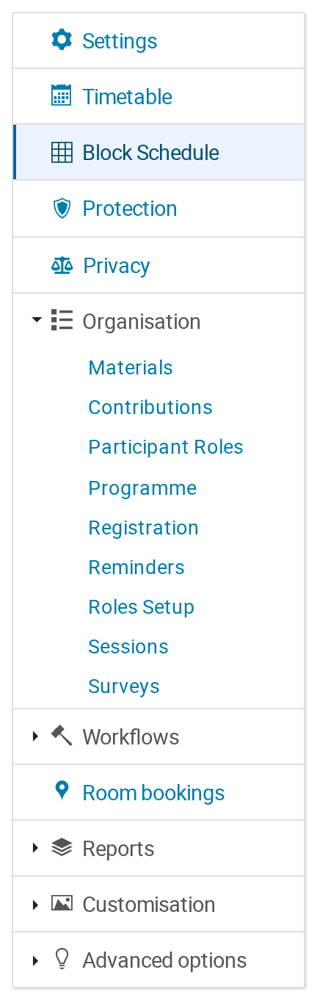

# 2. Turning Block Schedule on

Block Schedule is a **feature** of an event, like registration or surveys. It is
off until somebody turns it on.

## The switch

Go to your event's management area, open **Advanced options** at the bottom of
the side menu, and choose **Features**. Block Schedule is in the list:

> **Gives event managers a grid-based timetable: time down the rows, rooms
> across the columns.**

Turn it on and the event gains its menu entries.

## What the switch gives you

**In the management side menu**, a **Block Schedule** entry appears near the
top, just under **Timetable**:

**In the event's public navigation**, a **Block Schedule** entry appears for
your attendees, leading to the display page (chapter 11). This one is specific
to **conference**-type events, which are the ones with a public navigation menu;
a meeting or a lecture gets the management entry but has no menu for the public
entry to appear in.

Turn the switch off again and both entries disappear. The plugin's addresses
also stop answering — a bookmarked or guessed URL returns *not found* rather
than working around the switch. Nothing is deleted: turn it back on and your
grid is exactly as you left it.

## Defaults on an existing site

Two rules decide where the switch *starts*:

1. **A new event starts with it off** — unless your site administrator has
   turned on *Enabled by default* for the whole site.
2. **An event that already has a Block Schedule grid starts with it on.** This
   is there so that installing a new version of the plugin does not take
   working schedules off their event menus.

**Both rules are defaults, and Indico only consults a default for an event whose
feature list has never been touched.** As soon as anyone switches *any* feature
on or off for an event — registration, surveys, anything at all, not just this
one — that event has an explicit list of its own, and no default applies to it
again.

In practice most real events have touched some feature at some point, so do not
rely on rule 2 to carry an existing grid across an upgrade. Check the switch.

## Who can do what

- **Managers of the event** see the management page and can change anything on
  it.
- **Anyone who can see the event** sees the display page.
- The display page shows only the contributions that particular viewer is
  allowed to see. A talk protected inside an otherwise public event is absent
  from the grid, from the phone app's copy and from the public spreadsheet
  exports — you do not have to do anything to make that happen.
