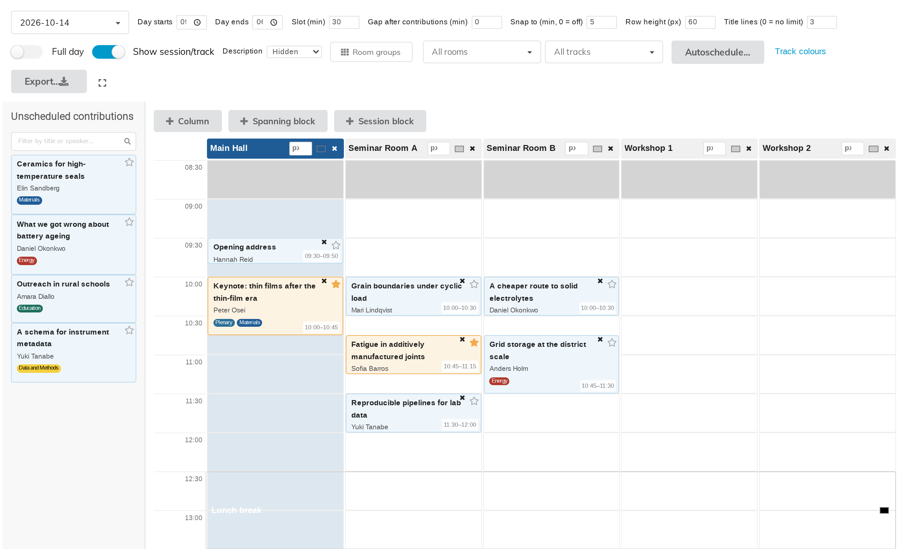
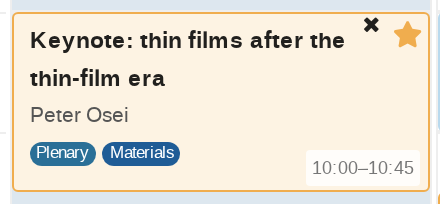
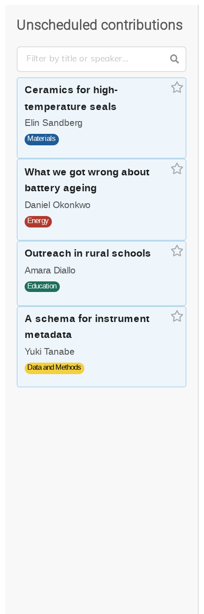
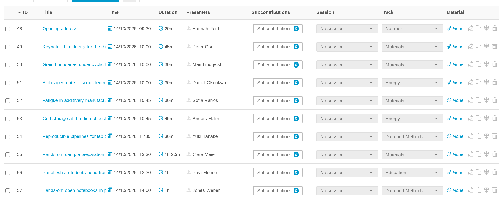

# 3. A tour of the management page

Open **Block Schedule** from the management side menu. Four parts make up the
page: the **toolbar** across the top, the **add bar** and the **grid** below it,
and the **unscheduled contributions** panel down the left-hand side. They are
described in that order below.

## 1. The toolbar

Everything that changes how the grid *behaves* or *looks* lives here.

| Control | What it does | Chapter |
|---|---|---|
| The date box | Which day of the event you are editing — shown only on events lasting more than one day | — |
| **Day starts**, **Day ends** | The working-hours window the grid shows | 5 |
| **Slot (min)** | How much time one grid row represents | 10 |
| **Gap after contributions (min)** | The gap GapSnap leaves after each talk | 5 |
| **Snap to (min, 0 = off)** | The rounding a dragged talk lands on | 5 |
| **Row height (px)** | How tall one row is drawn | 10 |
| **Title lines (0 = no limit)** | Where long titles are cut off | 10 |
| **Full day** | Show midnight to midnight instead of working hours | 5 |
| **Show session/track** | Whether the pill badges are drawn | 10 |
| **Description** | Hidden / Truncated / Full abstract preview | 10 |
| **Room groups** | Manage named sets of rooms | 9 |
| **All rooms**, **All tracks** | Narrow the grid to part of the programme | 9 |
| **Autoschedule…** | Fill a timespan automatically | 6 |
| **Track colours** | Give each track its own colour | 8 |
| **Export…** | CSV, ODS or Excel | 12 |
| The corner icon | Fullscreen | — |

**How each one is remembered** differs, and it is worth knowing which is which:

- **Day starts, Day ends, Slot, Gap, Snap to, Row height, Title lines, Show
  session/track and Description are saved per event.** There is no *Save*
  button: the toggles and the dropdown save the moment you change them, and the
  typed boxes save when you click or tab out of them. Pressing Enter does not
  commit — a value still sitting in a focused box has not been saved yet.
- **Full day lasts only for the current visit.** It is off again on the next
  page load.
- **The room and track filters live in the page address**, which is what lets a
  filtered view be bookmarked and shared (chapter 9). They are not stored
  against the event, so a fresh visit to the page starts unfiltered.

## 2. The add bar

Directly above the grid sit three buttons:

**Column**, **Spanning block** and **Session block** each open a small form
below the bar. Only one is open at a time. They live at the top of the
workspace so you can reach them without scrolling past a whole day first.

Columns are chapter 4; the two kinds of block are chapter 7.

## 3. The grid

One column per room, one row per slot, time down the left-hand gutter.

Each scheduled talk is drawn as a block whose **height is proportional to its
real duration**, so a 90-minute workshop is visibly three times a 30-minute
talk.

A block carries, from the top: its title, its speaker or speakers, its session
and track badges, and — bottom right — its start and end time. Two icons sit in
the top-right corner: **✕** removes the talk from the grid — as does dragging
the block back onto the unscheduled panel — and the **star** adds it to your
favourites.

Taking a talk off the grid does not delete the contribution — it goes back to
the unscheduled panel with its title, abstract, speakers and track intact. It
does, however, drop the note the grid was keeping of the talk's Indico
**session** (chapter 5 explains why that note exists), so a talk that had one
comes back without it and has to be re-assigned under **Organisation →
Contributions** if you want it again.

A talk you have starred is drawn with an amber border and a pale amber fill
wherever it appears, on this grid and on the display page alike.

## 4. The unscheduled contributions panel

Every contribution in the event that has no time yet is listed here, with its
speaker and its track badge. This is what you drag onto the grid.

At the top is a search box — **Filter by title or speaker…** — which narrows the
list as you type. The track filter in the toolbar narrows it too.

When there is nothing left the panel says **All contributions are scheduled.**
If a filter is hiding everything it says **No unscheduled contributions match
the current filters.** — worth knowing, because the two look similar at a glance
and mean very different things.

## Where the talks come from

Block Schedule never creates contributions. It only places the ones your event
already has. They are created and edited in the normal place —
**Organisation → Contributions**:

A contribution needs a **duration** to be placed sensibly; that is the one field
the grid really depends on.
