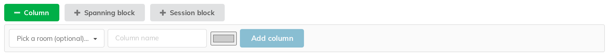

# 4. Columns

A column is one vertical division of the grid. In practice it is a room, and
its header is what attendees read at the top of the printed sheet.

A brand-new event has **no columns**, and an empty grid until you make one.
That is normal, not a broken install.

## Adding a column

Click **Column** in the add bar.

There are three fields and a button:

- **Pick a room (optional)…** — offers your site's Room Booking rooms.
  Choosing one **prefills the name**; the room is remembered against the column
  as a purely informational link, and nothing is booked or reserved by it. The
  label you type still governs everything anyone sees.
  **This field is only there if your site runs Indico's Room Booking module.**
  Without it the form is just the name, the colour swatch and **Add column** —
  which works exactly as well.
- **Column name** — the free-text label. This is what is drawn as the column
  header, and what appears as the room on each scheduled talk's own page.
- The small colour swatch — an optional colour for the column (see below).
- **Add column** — creates it, at the right-hand end.

**The column name is the truth.** Even when you pick a room, the label you type
is what everyone sees.

**To rename a column, click its title** in the column header and type.

The new name takes effect at once on the grid, the display page, the printed
sheet and the exports. It does **not** reach back into talks that are already
scheduled: each of those had the old label copied onto its own Indico
contribution page at the moment it was placed, and keeps it until it is moved
again. If that matters, rename the column *before* filling it, or drag its talks
once afterwards.

## Colour

A column can be given a colour. The header is drawn in the saturated colour and
the body of the column in a pale tint of it, which is a cheap way to make one
room — the main hall, the poster room — findable at a glance on a wide sheet.

Set it from the swatch in the add form, or from the swatch in an existing
column's header. There is no "no colour" swatch — a column you have never
coloured is drawn plain, and once coloured it stays coloured.

## Reordering

**Drag one column header onto another** to move it there. The order is saved
immediately and is the order used everywhere: the display page, the printed
sheet and the spreadsheet exports.

## Minimum width

Each column header carries a small box marked **px**. Hover it and it says
**Minimum column width (px), 0 for no minimum**.

By default columns share the available width evenly. Setting a minimum stops a
column being squeezed to unreadability when a lot of rooms are shown at once;
the grid scrolls sideways instead.

Leave it at 0 unless you have a specific column that must stay legible.

## Deleting a column

The **✕** in a column header deletes it.

- If the column is **empty**, you are asked to confirm and it goes.
- If it holds scheduled talks, the confirmation tells you **how many** will be
  affected. Those talks are **not deleted** — they are returned to the
  unscheduled contributions panel, ready to be placed somewhere else.

> **On a multi-day event, read that number with care.** The count in the
> confirmation is for **the day you are looking at**, but deleting a column
> removes it from the whole event: its talks on *every* day go back to the
> unscheduled panel. A dialog saying "2 scheduled contribution(s)" can be the
> visible tip of forty. Check the other days first.

A banner (chapter 7) that was drawn across only that column is dropped along
with it, since a banner spanning nothing has nothing to draw.
