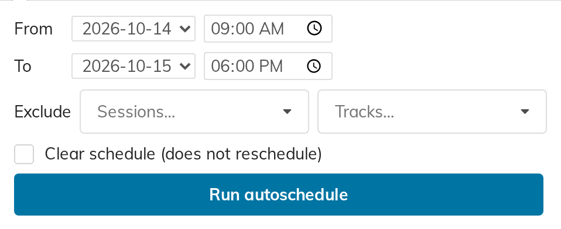

# 6. Autoschedule

Autoschedule fills a stretch of the grid with whatever is still sitting in the
unscheduled contributions panel. It is a starting point, not a finished
programme: run it, then drag things about.

Click **Autoschedule…** in the toolbar.

## The form

| Field | Meaning |
|---|---|
| **From** | The day and time to start filling |
| **To** | The day and time to stop |
| **Exclude → Sessions…** | Sessions it must not touch |
| **Exclude → Tracks…** | Tracks it must not touch |
| **Clear schedule (does not reschedule)** | See below |
| **Run autoschedule** | Do it |

## What it does

It offers every unscheduled contribution to the grid and places it in the first
free space it can find, subject to these rules:

- **Nothing is placed outside your working hours.** If you ask it to fill two
  days, it fills each day's **Day starts**–**Day ends** window in turn — never
  the night in between.
- **A session stays together — if it fits.** Contributions sharing a session are
  packed as one contiguous run into a single column, so a session is not split
  across parallel rooms. Contributions with no session are grouped by **track**
  instead, on the same rule.

  The exception matters: if the whole run — every talk in it plus the gaps
  between them — does not fit contiguously in *any* column anywhere in the
  timespan, the group is abandoned and its talks are placed individually,
  wherever there is room, possibly in parallel rooms. Widening the range or
  adding a column makes the contiguous placement possible again.
- **Talks with neither session nor track** are placed individually, wherever
  there is room.
- **The gap is respected.** Whatever you set as **Gap after contributions
  (min)** is left between one talk and the next.
- **Nothing already on the grid is disturbed.** Talks you placed by hand keep
  their slots; the autoscheduler works around them.
- **No two talks ever share a column at the same time.**

> **Banners are not obstacles.** The autoscheduler looks at *talks* and nothing
> else. Spanning blocks and session blocks (chapter 7) are invisible to it, so
> it will happily place a talk straight across your lunch break or underneath a
> session-block banner.
>
> Either autoschedule first and draw the banners afterwards, or run it in
> ranges that stop at the break — 09:00 to 12:30, then 13:30 to 18:00.

## It gives a different answer every time

Two things are **randomised on every run**: which run or single talk gets first
pick of the free space, and **the order of the talks inside each session or
track run**. The grouping rules above still hold, but nothing about the
particular arrangement will repeat — including the sequence a session's own
talks come out in, which you will have to put right by dragging if it matters.

This is deliberate — it lets you run it two or three times and keep the layout
you like best — but it does mean *"run it again to get back what I had"* will
not work. If you like an arrangement, stop running it.

## Excluding sessions and tracks

Anything you list under **Exclude** is left completely alone. It is not placed,
and it is not reported as left over either — the autoscheduler simply never
looks at it.

Use this when part of the programme is already fixed: exclude the plenary
session, autoschedule the rest.

## Clearing without refilling

Tick **Clear schedule (does not reschedule)** and the button becomes **Clear
schedule**. It empties the timespan you selected — every talk placed in it goes
back to the unscheduled panel — and stops there. It does **not** then refill.

Exclusions apply to clearing too, so you can empty a day while leaving the
plenary in place.

To clear and refill, do it in two runs: clear, then run again with the box
unticked. **But the second run is not the same as a fresh one.** Clearing takes
the talks off the grid, and taking a talk off the grid drops the note the grid
was keeping of its session (chapter 5). Those talks come back to the panel with
no session at all, so on the refill they are grouped by **track** instead — and
**Exclude → Sessions** no longer covers them.

If a session's grouping matters, exclude it rather than clearing it.

## What it tells you afterwards

One of three messages:

- **Everything was scheduled.**
- **Could not fit N contribution(s) in the given timespan: …** — with the
  titles. Widen the range, add a column, or place them by hand.
- **Schedule cleared for the given timespan.** — after a clear.

## Before you start

Three things will make it refuse before it starts:

- **No columns.** It has nowhere to put anything.
- **The To day and time is not after the From day and time.** Check the day as
  well as the clock on both rows.
- **The range does not overlap the working hours of any day.** Asking for 19:00
  to 22:00 against a 09:00–18:00 day leaves it nothing to fill.
