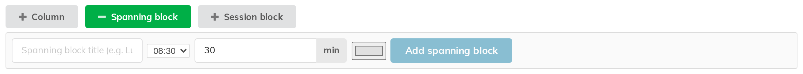
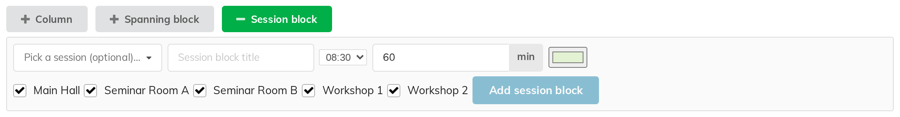

# 7. Spanning blocks and session blocks

Not everything on a programme is a contribution. Lunch happens in no room in
particular; a student session runs in two rooms and wants a heading. Block
Schedule draws those as **banners** rather than as talks.

There are two kinds, and the difference is simply **how many columns they
cover**.

## Spanning blocks — across every column

A spanning block is one bar drawn across the **whole width** of the grid for a
time range. Use it for anything that stops the parallel programme: lunch,
coffee, a plenary, the conference photo.

Click **Spanning block** in the add bar.

| Field | Notes |
|---|---|
| **Spanning block title (e.g. Lunch break)** | Required; it is what is drawn on the bar |
| Start time | A dropdown of the day's slots |
| Duration | In minutes — the **min** box |
| Colour | Optional |
| **Add spanning block** | Creates it |

Once on the grid a spanning block can be:

- **renamed** — click its title and type;
- **moved** — drag it up or down to another time;
- **recoloured** — the small swatch on the bar;
- **deleted** — the **✕** on the bar, which asks you to confirm first: the
  dialog names the banner and offers **Cancel** or **Delete**.

Spanning blocks are real Indico **breaks**, which cuts both ways: one you create
here appears in the built-in **Timetable** as a break, and a break somebody adds
in the built-in Timetable appears here as a spanning block.

> A spanning block does **not** block scheduling. You can still place a talk
> underneath one — the grid will let you, because sometimes that is exactly what
> you mean (a demo running through the lunch hour). It is a drawing, not a rule.

## Session blocks — across some columns

A session block is a banner drawn across **the columns you choose**, to head a
group of parallel talks: "Student Session" over the two seminar rooms,
"Workshops" over the workshop wing.

Click **Session block** in the add bar.

| Field | Notes |
|---|---|
| **Pick a session (optional)…** | Ties the banner to a real Indico session; it then takes that session's title and colour |
| **Session block title** | Use this instead if you are not tying it to a session — or to override the session's title |
| Start time, duration | As above |
| Colour | Offered only when **no** session is picked, since a tied banner takes the session's colour |
| The row of checkboxes | One per column — tick the columns the banner should cover. All are ticked by default. See the warning below |
| **Add session block** | Creates it |

> **The checkbox row lists the columns currently *shown*, not every column in the
> event** — so with a room, group or track filter active you are ticking a
> subset. And leaving *every* box ticked does not mean "these columns"; it is
> stored as "all columns", so the banner is drawn across every column in the
> event, including the ones the filter is hiding.
>
> Clear the filter before adding a banner, or untick and re-tick to pin an
> explicit set of columns.

On the grid the banner's title is drawn **once**, on the leftmost column it
covers, so a banner across three rooms reads as one continuous heading rather
than repeating itself three times.

A session block on the grid can be **recoloured** (the swatch) and **deleted**
(the **✕**, with the same confirmation). To change its time, its title or which
columns it covers, delete it and add it again.

## Why these are drawings, not structure

Indico's built-in timetable has its own notion of a session block, with talks
nested inside it. Block Schedule deliberately does **not** create those: nesting
would tie a talk's placement to its session and stop you putting any talk in
any column at any time, which is the whole point of the grid.

So these banners are presentational. A talk keeps its session badge whatever
banner happens to be drawn over it, and a banner has no effect on where talks
can go.

## Deleting a column that a banner covers

A session block created over **a chosen set of columns** narrows when one of
them goes, and is deleted when the last of them goes.

A session block left covering **all** columns is a different case: "all" is
stored as *all*, not as a list, so deleting a column neither narrows it nor
removes it. On a one-column grid that leaves an invisible banner in place, which
reappears across whatever columns you create next. If you delete a column and a
banner turns up where you did not expect one, that is where it came from —
delete it from the bar.
