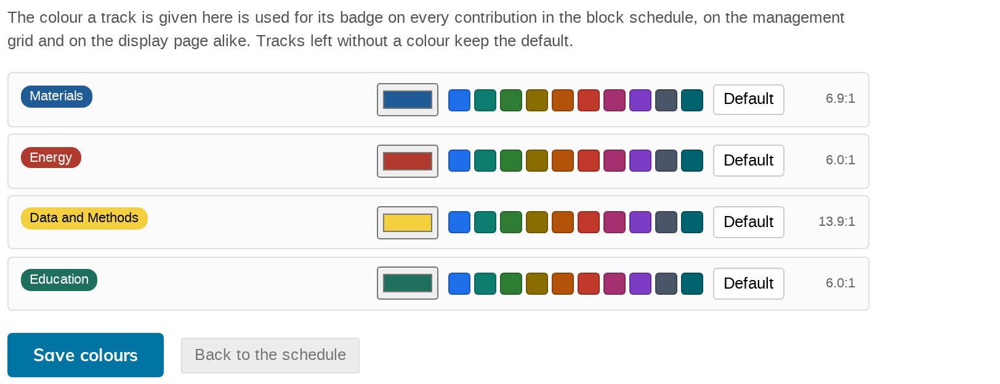

# 8. Track colours

Every contribution can carry a **track** badge. By default those badges are all
the same purple, which tells a reader nothing. Give each track its own colour
and the programme becomes readable at a glance — on screen and, more
importantly, on paper.

Click **Track colours** in the toolbar. It opens a page of its own, because
this is set-once configuration rather than something you fiddle with while
scheduling.

## Setting a colour

Each track has a row. From left to right:

- a **live preview** of the badge as it will actually be drawn;
- a colour box — click it for your system's colour picker;
- a **palette of suggested colours** — one click each, so setting up ten tracks
  is not ten trips through a colour picker;
- **Default** — puts that track back to the standard badge colour;
- the **contrast ratio** achieved, on the right.

Nothing is saved until you click **Save colours**. It confirms with **Saved.**
**Back to the schedule** returns you to the grid.

## Where the colour shows up

Everywhere the track badge appears:

- the management grid;
- the unscheduled contributions panel;
- the public display page;
- the phone app, which reads the same colours.

One colour, chosen once, used consistently.

## The text colour is not yours to choose

You pick the badge's **background**. The plugin picks the **text** colour, and
it only ever picks black or white — whichever of the two contrasts better with
your colour.

That guarantee is not decorative. Choosing the better of black and white can
never fall below a contrast ratio of about 4.58:1, which clears the WCAG AA
threshold of 4.5:1. **There is no colour you can pick that produces an
unreadable badge.**

The ratio in each row is what was actually achieved — hover it and it says
*WCAG contrast ratio of the badge text against its background*. In the picture
above, the pale yellow track gets black text at 13.9:1 while the deep blue gets
white text at 6.9:1, without anyone choosing either.

## If the page is empty

It says:

> **This event has no tracks yet. Add tracks under Programme, then come back
> here to give them colours.**

Tracks are an Indico feature, not a Block Schedule one. Create them under
**Organisation → Programme** and they appear here.

## Tracks you leave alone

A track with no colour set keeps the default badge on the management grid, the
unscheduled panel and the display page. You do not have to colour all of them —
colouring three tracks out of ten and leaving the rest plain is a perfectly good
way of drawing attention to three tracks.

**That trick does not survive onto the phone**, though. The app gives every
uncoloured track an automatic colour of its own rather than leaving it plain, so
"three coloured, seven plain" reads as ten coloured tracks there. If the
distinction matters to you, colour all of them or none.
