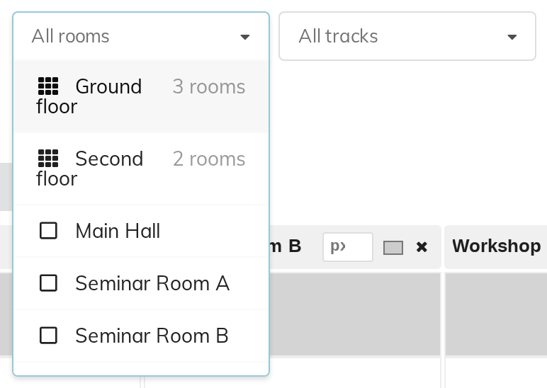
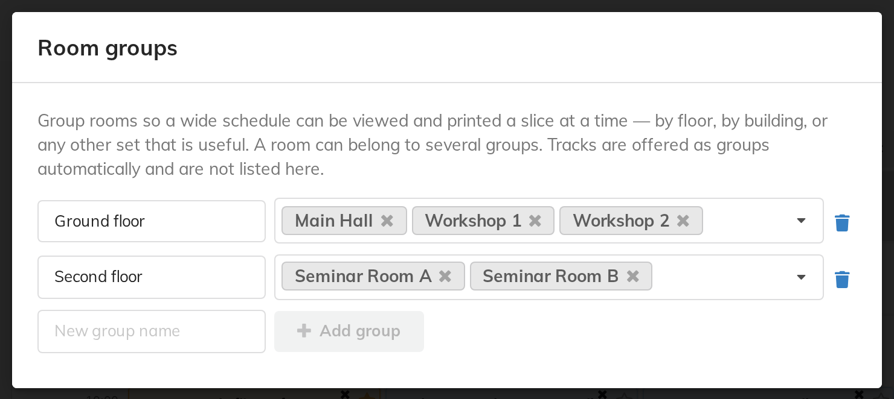
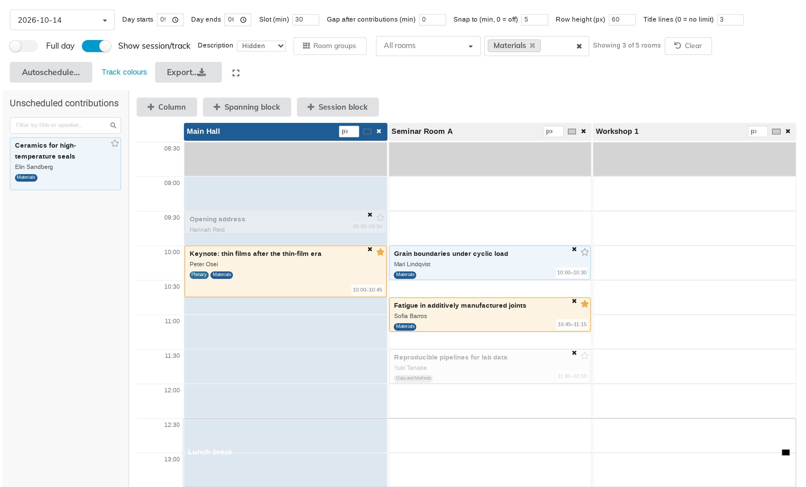

# 9. Room groups and filtering

A thirty-room schedule does not fit on a sheet of paper, or usefully on a
screen. Filtering is how you cut it into pieces that do.

Everything in this chapter works the same on the management page and on the
display page your attendees see, and both remember the filter in the address
bar (see the last section).

## The two filters

Two dropdowns sit in the toolbar: **All rooms** and **All tracks**. You can use
either, or both at once. The tracks one appears only once the event actually has
tracks (created under **Organisation → Programme**).

The rooms dropdown offers **named groups first**, each with the number of rooms
in it, then the individual rooms. Pick any combination — two groups and one
extra room is a perfectly ordinary selection.

Once anything is selected the toolbar reports **Showing 3 of 5 rooms** and
offers a **Clear** button to drop the filter entirely.

## Room groups

A group is a named set of columns — "Ground floor", "Main building",
"Workshops". Groups exist so a wide schedule can be viewed and printed a slice
at a time.

Click **Room groups** in the toolbar.

- Type a name in **New group name** and click **Add group**.
- **To rename a group**, edit the name box beside it; it saves as soon as you
  click or tab away.
- Choose the group's rooms in the dropdown beside its name.
- **A room can belong to several groups.** Groups are a way of looking at the
  schedule, not a way of partitioning it, so they may overlap as much as you
  like.
- The bin icon removes a group. Its rooms are not affected — you are deleting
  the grouping, not the columns.

**You never need to make a group per track.** Tracks have a filter of their own
— the **All tracks** dropdown, described next — so the room-groups panel does not
list them, and there is no "track group" to keep in step with your actual
tracks. (The panel's own wording for this is *Tracks are offered as groups
automatically and are not listed here*.)

## Filtering by track behaves differently on purpose

Filtering by **room** hides the other rooms. That is what you would expect.

Filtering by **track** does something more useful than hiding:

- It **keeps the rooms that host talks in those tracks** and drops the rest.
- Within the rooms it keeps, the talks in other tracks are **greyed out rather
  than removed**.

So the sheet still shows when a room is busy. Handing someone the "Materials"
programme that pretends the other four talks in that room do not exist would
send them to a room that turns out to be occupied. The dimmed blocks keep the
day honest.

## The unscheduled panel follows the track filter

On the management page, the **track** filter also narrows the unscheduled
contributions panel, which is what makes "place all the Energy talks" a
practical way to work: filter to Energy, and the panel holds only Energy.

The panel's own search box — **Filter by title or speaker…** — narrows it
further, and the two combine.

## Bookmarking and sharing a view

**The filter and the day are kept in the page address.** That means a
particular view can be bookmarked, mailed to a colleague, or reprinted next
year exactly as it was.

A reload does not lose your selection either. Changing a filter does **not**
add a step to the browser's history, though, so Back leaves the page rather than
undoing your last filter change — use **Clear** for that.

## Fullscreen

The icon at the end of the toolbar makes the grid fill the screen — **View
fullscreen**, and **Exit fullscreen** to come back. Available on both the
management and display pages. Useful on a projector, and useful when you are
placing talks into a lot of columns at once.
