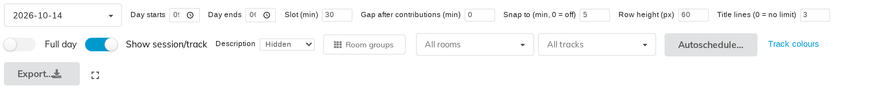

# 10. How the grid looks

Five toolbar settings control the drawing rather than the content. All of them
are saved per event, immediately, and all of them affect the display page and
the printed sheet as well as your own working view.

## Slot (min)

How much time one grid row represents. The default is 30.

A smaller slot gives a finer ruler and a taller page; a larger one is more
compact. It changes the ruler only — a 20-minute talk is still drawn 20 minutes
tall whatever the slot is.

## Row height (px)

How tall one row is drawn, in pixels. The default is 60.

**Slot and row height together set the scale.** 30 minutes per 60-pixel row is
two pixels a minute; halve the row height and the whole day fits in half the
space, with everything correspondingly smaller.

If a day will not fit on one printed page, this is the setting to reach for.

## Title lines (0 = no limit)

Contribution titles are cut off with an ellipsis after this many lines — three
by default.

Long titles otherwise crowd the speaker, the badges and the time out of the
block. The full title is still there on hover, and the limit applies to the
management grid too, so **what you arrange is what gets printed**.

Set it to 0 for no limit.

## Show session/track

Whether the pill badges are drawn on each block. Turn it off for a cleaner
sheet when the programme has no tracks worth showing, or when you are printing
one track at a time and the badge is redundant.

## Description

How much of each contribution's abstract to preview inside its block:

| Setting | Effect |
|---|---|
| **Hidden** | No abstract (the default) |
| **Truncated** | The first couple of hundred characters |
| **Full** | The whole abstract |

Formatting is stripped; this is a preview, not a rendering.

**Truncated** is worth trying when a programme's titles are too similar to tell
apart. **Full** makes for very tall blocks and is mostly useful on screen.

## What is deliberately not adjustable

**A block's height.** It is always proportional to the contribution's real
duration, so the grid cannot lie about how long anything takes. If a block is
the wrong size, the contribution's duration is wrong — fix it under
**Organisation → Contributions**.

**A badge's text colour.** Black or white, whichever contrasts better. See
chapter 8.
