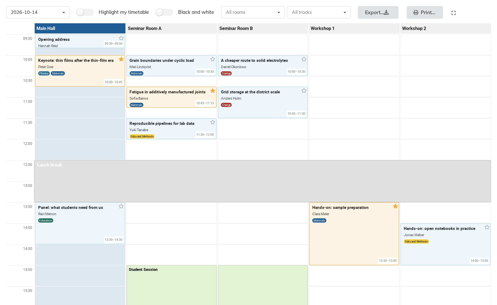
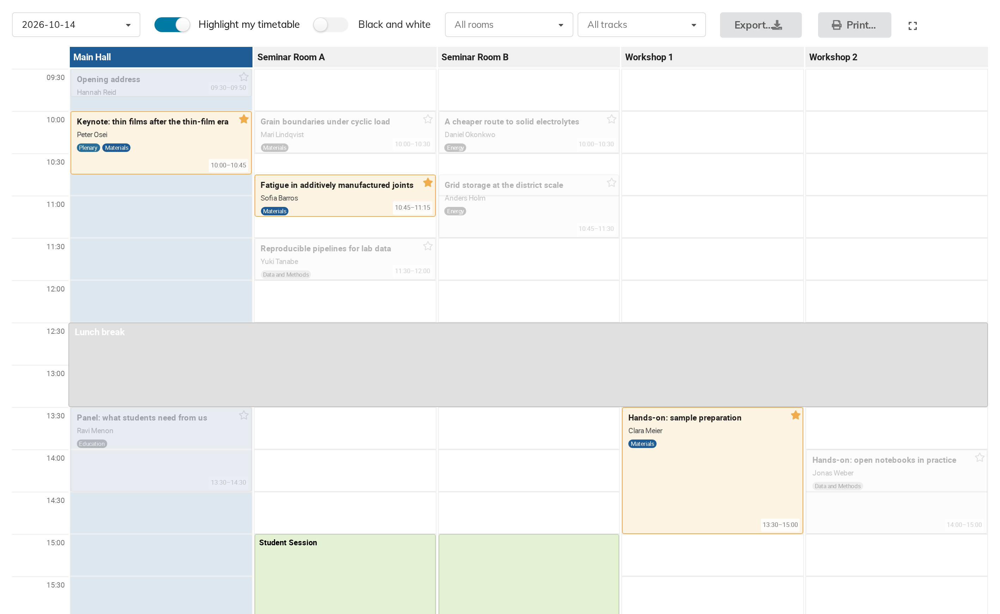

# 11. The page your attendees see

Turning the feature on adds a **Block Schedule** entry to the event's public
navigation. That is the display page: the same grid, without the editing.

Reach it yourself with **Switch to display view** at the top of the management
page and then **Block Schedule** in the event's own menu — which is exactly the
route an attendee takes.

## What is on it

| Control | What it does |
|---|---|
| The date box | Which day is shown |
| **Highlight my timetable** | See below — signed-in viewers only |
| **Black and white** | Drops all colour, for photocopying |
| **All rooms**, **All tracks** | The same filters as chapter 9 |
| **Export…** | CSV, ODS or Excel — chapter 12 |
| **Print…** | Chapter 12 |
| The corner icon | Fullscreen |

Every block links straight to its contribution's own page, so a reader can get
from the grid to the abstract in one click.

## Favourites, and "Highlight my timetable"

**For a signed-in viewer**, a **star** on every block adds that talk to their
favourites — the same "add to my timetable" favourite used elsewhere in Indico.
It works directly from the grid, without visiting each contribution's page.

A visitor who is not signed in sees **no stars and no Highlight my timetable
toggle** at all: both are drawn only when there is an account to attach a
favourite to. Worth remembering before telling attendees to "just tap the star"
— they have to log in first.

A starred talk is drawn with an amber border wherever it appears.

**Highlight my timetable** dims everything the viewer has *not* starred:

Notice that the dimmed talks **keep their slots**. Their day is still legible —
you can see what you are missing and when the room is busy — but the talks
chosen stand out. Turning the toggle off restores everything.

This is a per-viewer thing. It changes nothing about the event and nothing
another visitor sees.

## Black and white

Converts the whole grid to greyscale — column colours, track badges, session
badges and all.

This is the same conversion a monochrome printer does, so it is really a
preview: click it before printing and you see exactly which of your colours come
out as the same grey. Fixing that means changing the colours themselves
(chapter 8), not the toggle.

## Long days and wide grids

Two conveniences that are easy to miss:

**A wide grid gets a horizontal scrollbar pinned to the bottom of the window.**
The grid's own scrollbar sits at the foot of a table several screens tall — that
is to say, off screen exactly when it is wanted.

Note that the column headers on this page scroll away with the grid. The sticky
headers are a convenience of the management grid only, so on a very tall day it
is worth keeping the room order in mind, or filtering to fewer rooms.

## Who sees what

The display page shows only the contributions that particular viewer is allowed
to see. A talk protected inside a public event is absent from the grid — and
from the spreadsheet exports and the phone app's copy — for anyone without
access. A manager viewing the same page sees everything.

You do not have to configure this; it follows the event's own protection
settings.
