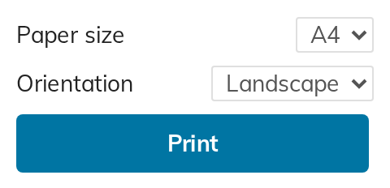
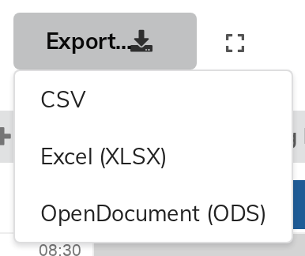

# 12. Printing and exporting

Both are available on the **display page**, and exporting is also on the
management page.

## Printing

Click **Print…** on the display page.

| Field | Choices |
|---|---|
| **Paper size** | A4, A3, A2 |
| **Orientation** | Landscape, Portrait |
| **Print** | Opens your browser's print dialogue |

### What gets printed

**Only the grid** — not the Indico header, not the event side menu, not the
breadcrumbs. Above it a header is added carrying:

- the **event title**;
- the **day** being shown;
- the **active filter**, if any.

That last line is what makes a stack of printed sheets usable. Print the same
day four times, once per floor, and each sheet says which floor it is.

### Getting a day onto one page

In order of usefulness:

1. **Filter.** One floor, or one track, per sheet. This is what room groups are
   for (chapter 9).
2. **Go bigger, or turn sideways.** A3 holds roughly twice an A4, and A2 roughly
   four times — turning the sheet sideways does not change its area, but it does
   change which way the grid has room to grow.
3. **Reduce Row height (px).** Halving it halves the height of the day.
4. **Reduce Title lines**, or turn **Show session/track** off, to narrow what
   each block has to hold.

### Printing in monochrome

Turn **Black and white** on first, and the print respects it.

What the toggle does is convert the grid to greyscale on screen — the same
conversion a monochrome printer performs, so it is a **preview** of what you are
about to get. That is its real value: two track colours of similar brightness
collapse to the same grey, and this is where you find that out and go and change
one of them (chapter 8), rather than after printing forty sheets.

## Exporting

Click **Export…**.

Three formats: **CSV**, **Excel (XLSX)** and **OpenDocument (ODS)**. Each
exports **the whole of the day currently shown**.

> **Exporting is not filtered.** Unlike printing, which prints the filtered view,
> an export always contains every room and every track for that day, whatever
> the toolbar is set to. Filter the spreadsheet after you open it.

### What is in the file

**CSV** is one flat table, one row per scheduled contribution, sorted by column
and then by time, with these fields:

| Column | Start | End | Duration (min) | Title | Speakers | Session | Track |
|---|---|---|---|---|---|---|---|

**Excel and OpenDocument** carry that same table as a first sheet named
*Contributions*, and add a second sheet named **Schedule Grid** — which is laid
out like the visual grid itself. One spreadsheet column per room, time down the
side, and **one merged cell per presentation** spanning its real duration,
carrying its room, session, track, author(s) and date/time.

That second sheet is the one to send to whoever lays out the printed programme:
it opens in any spreadsheet application and already has the shape of the page.

### Exporting from the display page

The same menu is on the display page, and there it exports **what that viewer
is allowed to see**. A contribution protected inside a public event is not in
the file. The management export has no such restriction, since a manager can
see everything anyway.
