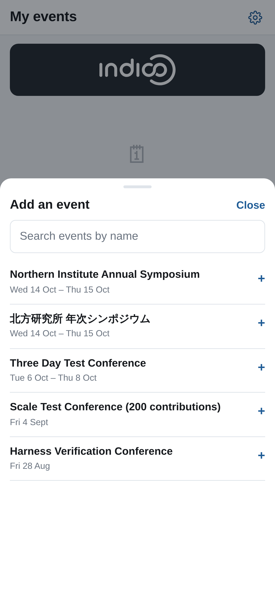
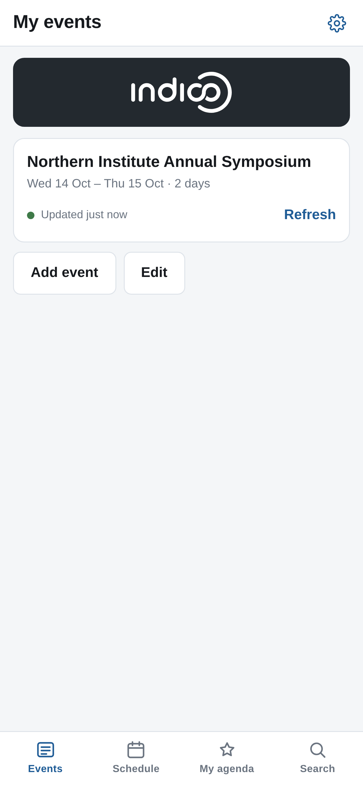
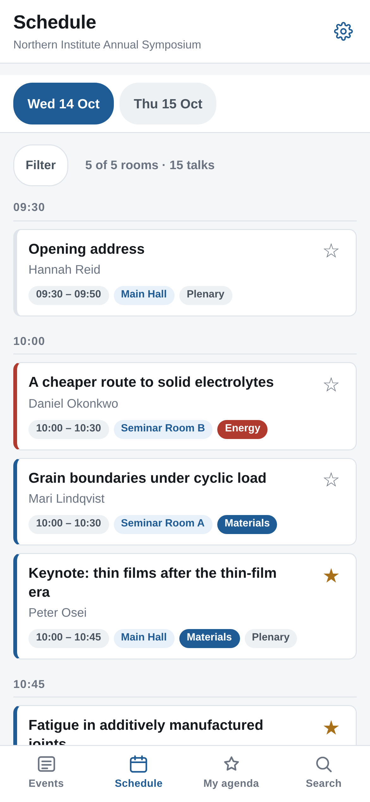
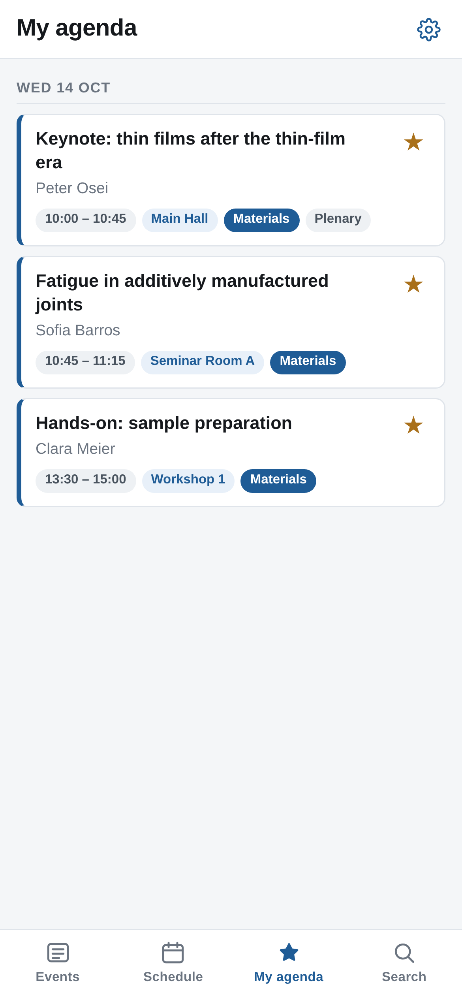
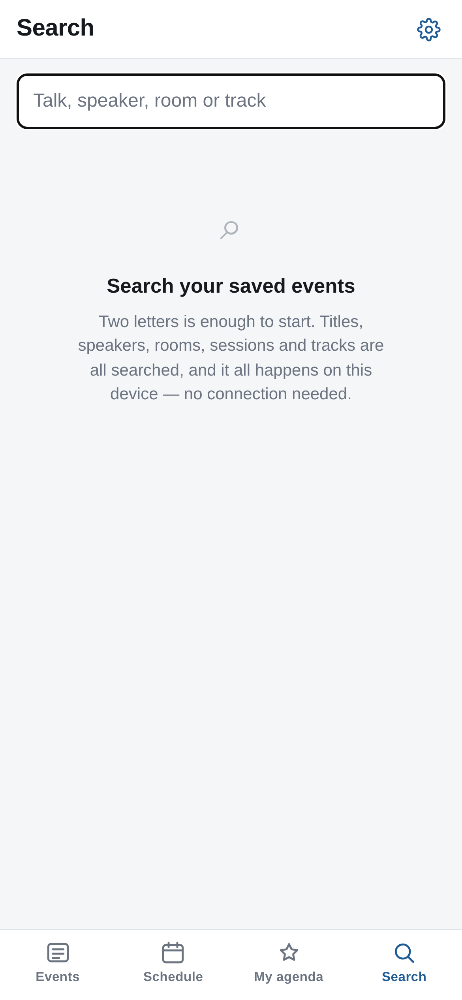

# 13. The phone app

Sites running Block Schedule can also offer attendees a **phone app** that reads
the same schedule. It is a separate piece of software, installed by whoever runs
your Indico site — but what it shows is what *you* build, so it is worth knowing
what reaches it.

Ask your site administrator whether it is available and at what address; it is
typically **/schedule-app/** on the same site.

## What an attendee does

They open the address, tap **Add event**, and find your conference — either by
browsing down Indico's category tree from the top, or by typing its name into
the search box:

Only events that **actually have a block schedule** are offered. In a large
category the list fills in a batch at a time, with a button to keep checking. The
whole programme is then copied onto the phone, and works from then on with no
signal.

## What they see

Thirty rooms do not fit in a phone screen, so the grid becomes a time-ordered
list of the day — the same talks, the same times, the same rooms:

Note what is carried over from your work: the **room labels** you typed, the
**track names and their colours** from chapter 8, and the session names.

A **Filter** sheet narrows the day by room group, individual room or track,
using the same rules and the same URL parameters as the plugin's own filter
(chapter 9) — so a filtered link works in the app as well as in the browser. The
room groups you set up are what make that useful.

Tapping a talk opens its own screen with the **full abstract** and the speakers'
affiliations, held on the device. Those come from Indico's contributions export,
which only answers once the event's contributions have been **published** —
until then the app says *No abstract was published for this talk.*

**Starring requires the attendee to be signed in to Indico.** Tapping a star
while signed out raises a sign-in sheet rather than saving anything, and the
agenda tab shows a signed-out state instead of a list. Signing out again removes
the copy of the agenda from the device, leaving it on the account.

Starred talks collect in **My agenda**, across every event they have added.
Overlapping talks are boxed together so a double-booking is visible as one fact
rather than two rows twelve rows apart:

Search runs over the copy on the phone rather than over the network, so it works
in a basement with no signal — and it covers titles, speakers, rooms, sessions
and tracks, which is what makes "which room is Okonkwo in?" answerable:

## What you control

Everything an attendee sees in the app comes from Indico, so the things you
already do are the things that reach it:

| What you do | Where it shows in the app |
|---|---|
| Name a column | The room on every talk |
| Set **track colours** (chapter 8) | The stripe and pill on every talk |
| Set the event's **logo** under Customisation → Layout | The event's card in the library |
| Publish the contributions | Their abstracts become readable on the talk screen |
| Protect a contribution | It is absent from the copy on the phone |
| Reschedule anything | On the attendee's next refresh |

Stars are shared with Indico itself: one set in the app appears on your event's
own pages, and one set on the website appears in the app.

## Things worth telling attendees

- **The app needs to be refreshed** to pick up programme changes. Each event's
  card says how fresh its copy is and has a **Refresh** button. If you change
  the programme the day before, say so.
- **It is bilingual** — the interface follows the phone's language, English or
  Japanese, with an override in its settings. Your talk titles, speaker names,
  rooms and tracks are shown exactly as you wrote them, in whatever language you
  wrote them.
- **Home-screen installation and full offline use need HTTPS.** On a site served
  over plain `http://` the app still works in the browser but cannot be
  installed, and says so.

## What it is not

It is not a registration system, a notification service or a place to publish
anything. It is a read-only copy of the schedule you have already published, in
a shape that survives a conference centre basement with no signal.
