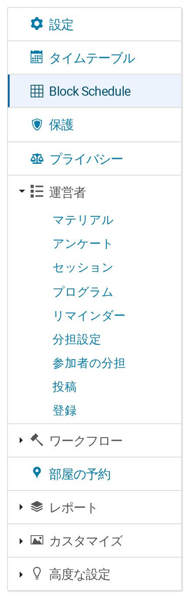

# 2. Block Schedule を有効にする

Block Schedule は、登録やアンケートと同じく、イベントの**機能**の1つです。誰かがオンにするまでは無効です。

## スイッチ

イベントの管理画面を開き、サイドメニュー下部の**高度な設定**から**機能**を選びます。一覧の中に Block Schedule があります。

> **イベント管理者にグリッド形式のタイムテーブルを提供します。行が時間、列が部屋です。**

オンにすると、メニュー項目が追加されます。

## スイッチで何が増えるか

**管理サイドメニュー**には、**タイムテーブル**のすぐ下に **Block Schedule** の項目が現れます。

**イベントの公開メニュー**には、参加者向けに **Block Schedule** の項目が現れ、表示ページ（第11章）へつながります。こちらは公開メニューを持つ**カンファレンス**形式のイベント専用です。ミーティングや講義の場合、管理側の項目は現れますが、公開側の項目を表示するメニュー自体がありません。

スイッチをオフに戻すと、どちらの項目も消えます。プラグインの URL も応答しなくなり、ブックマークや URL の直接入力でスイッチを迂回することはできません。何も削除はされません。もう一度オンにすれば、グリッドはそのまま残っています。

## 既存サイトでの初期値

スイッチの**初期状態**は、次の2つのルールで決まります。

1. **新規イベントではオフ**です。ただし、サイト管理者がサイト全体で*デフォルトで有効*を設定している場合は除きます。
2. **すでに Block Schedule のグリッドがあるイベントではオン**になります。プラグインを新しい版に更新したときに、動いているスケジュールがイベントメニューから消えてしまわないようにするためです。

**どちらもあくまでデフォルトであり、Indico がデフォルトを参照するのは、そのイベントの機能一覧が一度も変更されていない場合だけです。** 誰かが*いずれかの*機能を一度でもオン・オフした時点で（登録でもアンケートでも、この機能に限りません）、そのイベントは独自の設定を持つことになり、以後デフォルトは適用されません。

実際のイベントはたいてい何らかの機能を触っているため、更新時にルール2が既存のグリッドを守ってくれるとは考えないでください。スイッチを確認してください。

## 誰に何ができるか

- **イベントの管理者**は管理画面を開き、そこにあるすべてを変更できます。
- **イベントを閲覧できる人**は表示ページを見られます。
- 表示ページには、**その閲覧者が見てよい投稿だけ**が表示されます。公開イベントの中で保護されている投稿は、グリッドにも、スマートフォンアプリが保存するデータにも、公開側の表計算エクスポートにも現れません。そのための設定は不要です。
