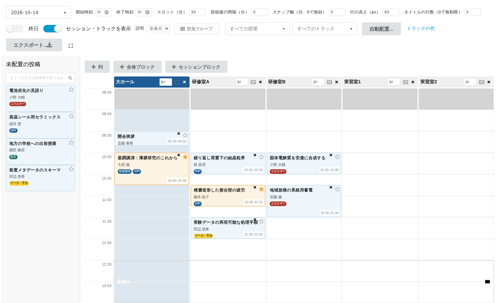
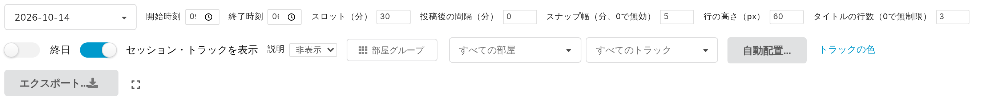
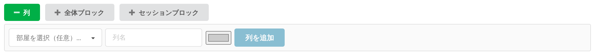
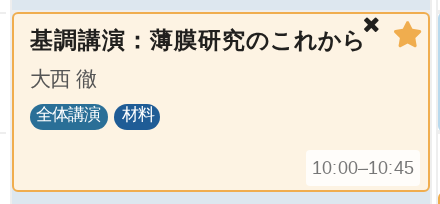
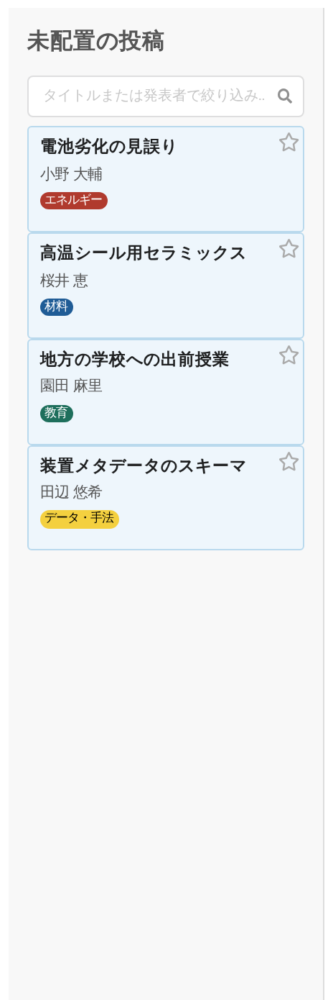
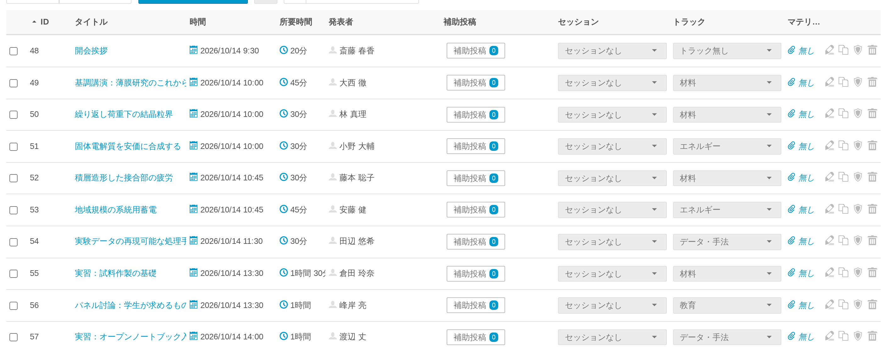

# 3. 管理画面の全体像

管理サイドメニューから **Block Schedule** を開きます。画面は4つの部分でできています。上部の**ツールバー**、その下の**追加バー**と**グリッド**、そして左側の**未配置の投稿**パネルです。以下ではこの順に説明します。

## 1. ツールバー

グリッドの*動き*や*見た目*を変える設定は、すべてここにあります。

| コントロール | 役割 | 章 |
|---|---|---|
| 日付の選択 | 編集する日。2日以上のイベントでのみ表示されます | — |
| **開始時刻**、**終了時刻** | グリッドが表示する時間帯 | 5 |
| **スロット（分）** | グリッド1行が表す時間 | 10 |
| **投稿後の間隔（分）** | GapSnap が各投稿の後に空ける間隔 | 5 |
| **スナップ幅（分、0で無効）** | ドラッグした投稿が丸められる単位 | 5 |
| **行の高さ（px）** | 1行の描画高さ | 10 |
| **タイトルの行数（0で無制限）** | 長いタイトルを省略する行数 | 10 |
| **終日** | 表示時間帯ではなく1日全体を表示 | 5 |
| **セッション・トラックを表示** | バッジを描画するかどうか | 10 |
| **説明** | 非表示／省略／全文 | 10 |
| **部屋グループ** | 部屋のグループを管理 | 9 |
| **すべての部屋**、**すべてのトラック** | 表示範囲を絞り込む | 9 |
| **自動配置…** | 時間帯をまとめて埋める | 6 |
| **トラックの色** | トラックごとに色を設定 | 8 |
| **エクスポート…** | CSV、ODS、Excel | 12 |
| 隅のアイコン | 全画面表示 | — |

**保存のされ方**は設定によって違うので、区別しておいてください。

- **開始時刻、終了時刻、スロット、投稿後の間隔、スナップ幅、行の高さ、タイトルの行数、セッション・トラックを表示、説明はイベントごとに保存されます。** *保存*ボタンはありません。トグルとプルダウンは変更した瞬間に、入力欄は他の場所をクリックするかタブで移動した時点で保存されます。Enter キーでは確定しません。入力したままフォーカスが残っている値は、まだ保存されていません。
- **終日は、今表示している間だけ有効です。** 次にページを開いたときはオフに戻ります。
- **部屋とトラックの絞り込みは、ページの URL に保持されます。** 絞り込んだ画面をブックマークしたり共有したりできるのはそのためです（第9章）。イベントには保存されないので、改めてページを開くと絞り込みなしの状態から始まります。

## 2. 追加バー

グリッドのすぐ上に3つのボタンがあります。

**列**、**全体ブロック**、**セッションブロック**は、それぞれバーの下に小さなフォームを開きます。同時に開けるのは1つだけです。1日分をスクロールして通り過ぎなくても届くように、作業領域の上部に置かれています。

列は第4章、2種類のブロックは第7章で扱います。

## 3. グリッド

1部屋につき1列、1スロットにつき1行、時間は左の目盛りに表示されます。

配置された投稿はブロックとして描かれ、その**高さは実際の所要時間に比例します**。90分のワークショップは、30分の講演の3倍の高さになります。

ブロックには上から、タイトル、発表者、セッションとトラックのバッジ、そして右下に開始・終了時刻が表示されます。右上には2つのアイコンがあります。**✕** はグリッドから投稿を外し（ブロックを未配置の投稿パネルへドラッグして戻しても同じです）、**星**はお気に入りに追加します。

グリッドから外しても投稿そのものは削除されません。タイトル、説明、発表者、トラックはそのままで、未配置の投稿パネルに戻ります。ただし、グリッドが保持していた Indico の**セッション**の控えは失われます（この控えがなぜ存在するかは第5章で説明します）。セッションがあった投稿はセッションなしの状態で戻るため、必要であれば**運営者 → 投稿**で割り当て直してください。

## 4. 未配置の投稿パネル

まだ時間が決まっていない投稿が、発表者とトラックのバッジとともにここに並びます。これをグリッドへドラッグします。

上部には検索欄（**タイトルまたは発表者で絞り込み…**）があり、入力に応じて絞り込まれます。ツールバーのトラック絞り込みもこのパネルに効きます。

何も残っていないときは**すべての投稿が配置されています。**と表示されます。絞り込みですべて隠れているときは**現在の絞り込み条件に一致する未配置の投稿はありません。**と表示されます。ぱっと見は似ていますが、意味はまったく違うので注意してください。

## 投稿はどこから来るのか

Block Schedule が投稿を作ることはありません。イベントにすでにある投稿を配置するだけです。投稿の作成と編集は通常どおり**運営者 → 投稿**で行います。

適切に配置するには投稿に**所要時間**が必要です。グリッドが本当に依存しているのはこの項目です。
