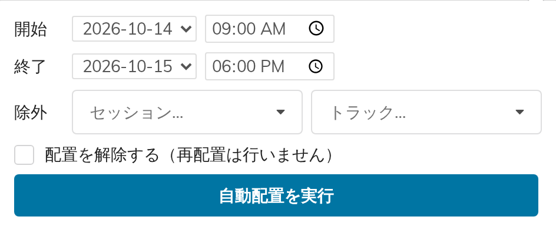

# 6. 自動配置

自動配置は、未配置の投稿パネルに残っている投稿で、グリッドの一定の時間帯を埋めます。完成したプログラムではなく出発点です。実行したうえで、ドラッグして整えてください。

ツールバーの**自動配置…**をクリックします。

## フォームの項目

| 項目 | 意味 |
|---|---|
| **開始** | 埋め始める日と時刻 |
| **終了** | 埋め終える日と時刻 |
| **除外 → セッション…** | 触れないセッション |
| **除外 → トラック…** | 触れないトラック |
| **配置を解除する（再配置は行いません）** | 下記参照 |
| **自動配置を実行** | 実行します |

## 何をするのか

未配置の投稿を順にグリッドへ提示し、見つかった最初の空きに配置します。そのとき、次のルールに従います。

- **表示時間帯の外には配置しません。** 2日分を指定した場合は、各日の**開始時刻**〜**終了時刻**を順に埋めます。あいだの夜間は決して使いません。
- **セッションはまとまって配置されます — 収まる場合は。** 同じセッションの投稿は連続したひとまとまりとして1つの列に詰められ、並行する部屋に分割されません。セッションのない投稿は、同じルールで**トラック**ごとにまとめられます。

  この例外は重要です。まとまり全体（すべての投稿の所要時間と間隔の合計）が、指定した時間帯の*どの*列にも連続して収まらない場合、そのまとまりは解体され、各投稿が個別に空いている場所へ配置されます。並行する部屋に分かれることもあります。範囲を広げるか列を増やせば、まとまった配置が可能になります。
- **セッションもトラックもない投稿**は、空いている場所に個別に配置されます。
- **間隔が守られます。** **投稿後の間隔（分）**に設定した時間が、投稿と投稿のあいだに空けられます。
- **すでにグリッドにあるものは動きません。** 手作業で配置した投稿はその位置のままで、自動配置はそれを避けて動きます。
- **同じ列の同じ時間帯に2つの投稿が入ることはありません。**

> **ブロックは障害物になりません。** 自動配置が見ているのは*投稿*だけです。全体ブロックとセッションブロック（第7章）は自動配置からは見えないため、昼休みの上や、セッションブロックの見出しの下にも平気で投稿を置きます。
>
> 先に自動配置してから見出しを描くか、休憩で区切った範囲を指定して実行してください（09:00〜12:30、そのあと13:30〜18:00 のように）。

## 実行するたびに結果が変わります

**実行するたびに2つのことが無作為に決まります。** どのまとまり・どの投稿が空き時間を先に取るか、そして**各セッション・トラックのまとまりの中での投稿の並び順**です。上記のルールは常に守られますが、配置そのものは再現しません。セッション内の講演の順序も含めて変わるので、順序が重要な場合はあとからドラッグして直してください。

これは意図的な設計です。2〜3回実行して気に入った配置を選べるようにするためですが、*「もう一度実行すれば元に戻る」*ということはありません。気に入った配置ができたら、そこで実行をやめてください。

## セッション・トラックを除外する

**除外**に指定したものには一切触れません。配置もされませんし、収まらなかったものとして報告されることもありません。自動配置はそれらを最初から対象にしません。

プログラムの一部がすでに確定しているときに使います。全体講演を除外して、残りを自動配置する、といった具合です。

## 再配置せずに解除だけする

**配置を解除する（再配置は行いません）**にチェックを入れると、ボタンが**配置を解除**に変わります。選択した時間帯を空にし、そこに配置されていた投稿をすべて未配置の投稿パネルに戻して、そこで終わります。そのあと自動的に埋め直すことは**ありません**。

除外は解除にも適用されるので、全体講演を残したまま1日を空にすることもできます。

解除してから埋め直したい場合は、2回に分けて実行します。まず解除し、次にチェックを外して実行します。**ただし、2回目は最初からやり直したのと同じにはなりません。** 解除は投稿をグリッドから外すことであり、グリッドから外すとその投稿のセッションの控えが失われます（第5章）。それらの投稿はセッションなしの状態でパネルに戻るため、埋め直しでは**トラック**ごとにまとめられ、**除外 → セッション**の対象にもなりません。

セッションのまとまりが重要なら、解除するのではなく除外してください。

## 実行後のメッセージ

次の3つのいずれかが表示されます。

- **すべて配置しました。**
- **指定した時間帯に収まらなかった投稿がN件あります：…** — タイトルが併記されます。範囲を広げる、列を増やす、または手作業で配置してください。
- **指定した時間帯の配置を解除しました。** — 解除を実行した場合。

## 実行前に

次の3つに当てはまると、実行前に拒否されます。

- **列がない。** 置く場所がありません。
- **終了の日時が開始の日時より後になっていない。** 時刻だけでなく日付も確認してください。
- **指定した範囲が、どの日の表示時間帯とも重ならない。** 09:00〜18:00 の日に対して 19:00〜22:00 を指定しても、埋める場所がありません。
