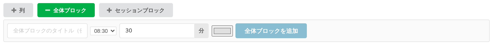
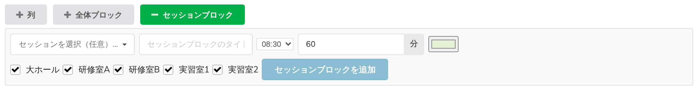

# 7. 全体ブロックとセッションブロック

プログラムに載るものがすべて投稿とは限りません。昼休みはどの部屋のものでもありませんし、2つの部屋で行う学生セッションには見出しが必要です。Block Schedule はそうしたものを投稿ではなく**帯（見出し）**として描きます。

2種類あり、違いは単純に**いくつの列にまたがるか**です。

## 全体ブロック — すべての列にまたがる

全体ブロックは、ある時間帯にグリッドの**全幅**にわたって描かれる1本の帯です。並行プログラムを止めるもの — 昼休み、コーヒーブレイク、全体講演、記念撮影 — に使います。

追加バーの**全体ブロック**をクリックします。

| 項目 | 補足 |
|---|---|
| **全体ブロックのタイトル（例：昼休み）** | 必須。帯に描かれる文字です |
| 開始時刻 | その日のスロットから選びます |
| 所要時間 | **分**の欄に分単位で入力します |
| 色 | 任意 |
| **全体ブロックを追加** | 作成します |

グリッドに置いた全体ブロックには、次の操作ができます。

- **名前を変える** — タイトルをクリックして入力します
- **移動する** — 上下にドラッグして時刻を変えます
- **色を変える** — 帯の上の小さな色見本
- **削除する** — 帯の上の **✕**。すぐには削除されず、対象の名前を示した確認画面が開き、**キャンセル**か**削除**を選びます

全体ブロックは Indico の**休憩**そのものです。これは双方向に働きます。ここで作った全体ブロックは標準の**タイムテーブル**に休憩として現れ、標準のタイムテーブルで誰かが追加した休憩はここに全体ブロックとして現れます。

> 全体ブロックは配置を**妨げません**。その下に投稿を置くこともできます。昼休みをまたいで続くデモなど、意図的にそうしたい場合があるからです。これはルールではなく、描画です。

## セッションブロック — 一部の列にまたがる

セッションブロックは、**選んだ列**にまたがって描かれる見出しです。並行する複数の講演をひとまとめに見せるために使います。2つの研修室にまたがる「学生セッション」、実習棟にまたがる「実習」などです。

追加バーの**セッションブロック**をクリックします。

| 項目 | 補足 |
|---|---|
| **セッションを選択（任意）…** | 実際の Indico のセッションと結び付けます。タイトルと色はそのセッションのものになります |
| **セッションブロックのタイトル** | セッションと結び付けない場合はこちらを使います。セッションのタイトルを上書きすることもできます |
| 開始時刻、所要時間 | 上記と同じです |
| 色 | セッションを**選んでいない**場合にのみ表示されます。結び付けた場合はセッションの色が使われます |
| チェックボックスの並び | 列ごとに1つ。見出しをかけたい列にチェックを入れます。既定ではすべてオンです。下の注意も参照してください |
| **セッションブロックを追加** | 作成します |

> **チェックボックスの並びに出るのは、いま*表示されている*列だけです。** イベントのすべての列ではありません。部屋・グループ・トラックで絞り込んでいる場合、選んでいるのはその一部です。さらに、*すべて*のチェックを入れたままにすると「この列とこの列」ではなく「すべての列」として保存され、絞り込みで隠れている列も含めたイベント全体の列に見出しが描かれます。
>
> 見出しを追加する前に絞り込みを解除するか、いったんチェックを外して入れ直し、対象の列を明示的に指定してください。

グリッド上では、見出しの文字は**またがる列のうち左端の1つ**にだけ描かれます。3つの部屋にまたがる見出しがタイトルを3回繰り返すのではなく、1本の連続した見出しとして読めるようにするためです。

グリッド上のセッションブロックには、**色の変更**（色見本）と**削除**（**✕**、同じ確認画面が出ます）ができます。時刻、タイトル、またがる列を変えるには、いったん削除して追加し直してください。

## なぜ「構造」ではなく「描画」なのか

Indico 標準のタイムテーブルには独自のセッションブロックがあり、投稿はその中に入れ子になります。Block Schedule はそれを意図的に作りません。入れ子にすると投稿の配置がセッションに縛られ、どの投稿もどの列のどの時刻にも置けるというグリッドの利点が失われるからです。

したがってこれらの見出しは見せ方の問題です。上にどの見出しが描かれていても投稿は自分のセッションバッジを保ち、見出しが投稿の配置可能な場所を変えることもありません。

## 見出しがかかる列を削除すると

**列を選んで**作ったセッションブロックは、その中の1つの列が削除されると狭くなり、最後の1列が削除されると一緒に削除されます。

**すべての列**にまたがるセッションブロックは事情が違います。「すべて」は列の一覧ではなく*すべて*として保存されるため、列を削除しても狭くなりませんし、削除もされません。列が1つしかないグリッドでは、見えない見出しがデータとして残り、次に列を作ったときにその上に現れます。列を削除したあとに覚えのない見出しが出てきたら、原因はこれです。帯の ✕ から削除してください。
