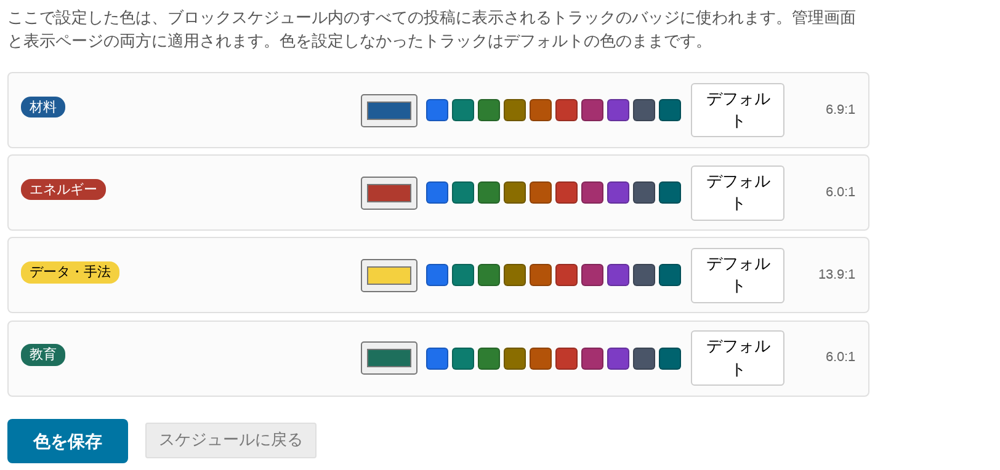

# 8. トラックの色

投稿にはトラックのバッジを表示できます。既定ではすべて同じ紫色で、読み手には何も伝わりません。トラックごとに色を設定すると、プログラムがひと目で読めるようになります。画面上でも、そして何より紙の上で。

ツールバーの**トラックの色**をクリックします。設定は専用のページで行います。配置作業のあいだに何度もいじるものではなく、一度決める設定だからです。

## 色を設定する

トラックごとに1行あります。左から順に、

- 実際に描かれるとおりのバッジの**プレビュー**
- 色の入力欄 — クリックすると OS の色選択画面が開きます
- **候補の色のパレット** — 1クリックで選べます。10個のトラックを設定するのに、色選択画面を10回開かずに済みます
- **デフォルト** — そのトラックを標準のバッジ色に戻します
- 右端に、実際に得られた**コントラスト比**

**色を保存**をクリックするまで保存されません。保存すると**保存しました。**と表示されます。**スケジュールに戻る**でグリッドに戻ります。

## 色が反映される場所

トラックのバッジが表示されるすべての場所です。

- 管理グリッド
- 未配置の投稿パネル
- 公開の表示ページ
- 同じ色を読み込むスマートフォンアプリ

一度決めた色が、一貫して使われます。

## 文字色は選べません

選べるのはバッジの**背景色**です。**文字色**はプラグインが決め、黒か白のどちらか、設定した色に対してコントラストが高い方が選ばれます。

これは飾りではありません。黒と白のうち良い方を選ぶ限り、コントラスト比は約 4.58:1 を下回ることがなく、WCAG AA の基準（4.5:1）を必ず満たします。**どの色を選んでも、読めないバッジになることはありません。**

各行に表示される比率は実際に得られた値です。マウスを乗せると**バッジの文字と背景の WCAG コントラスト比**と表示されます。上の図では、淡い黄色のトラックが黒い文字で 13.9:1、濃い青のトラックが白い文字で 6.9:1 になっており、どちらも誰かが選んだわけではありません。

## ページに何も表示されないとき

次のように表示されます。

> **このイベントにはまだトラックがありません。プログラムからトラックを追加してから、この画面で色を設定してください。**

トラックは Block Schedule ではなく Indico の機能です。**運営者 → プログラム**で作成すると、ここに現れます。

## 色を設定しないトラック

色を設定していないトラックは、管理グリッド・未配置の投稿パネル・表示ページでは標準のバッジのままです。すべてに色を付ける必要はありません。10個のうち3個だけに色を付けて残りをそのままにするのも、その3つに注意を向けるうえで十分に有効な方法です。

**ただし、この使い分けはスマートフォンアプリには引き継がれません。** アプリは色を設定していないトラックにも自動で色を割り当てるため、そこでは10個すべてが色付きに見えます。この区別が重要な場合は、すべてに色を付けるか、まったく付けないかにしてください。
