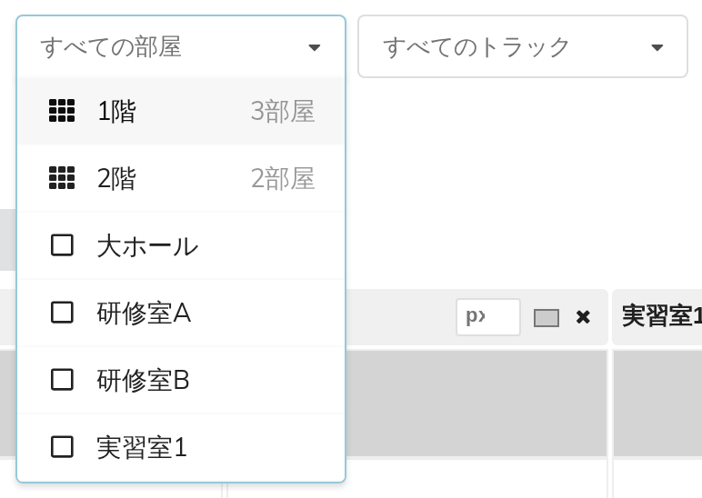
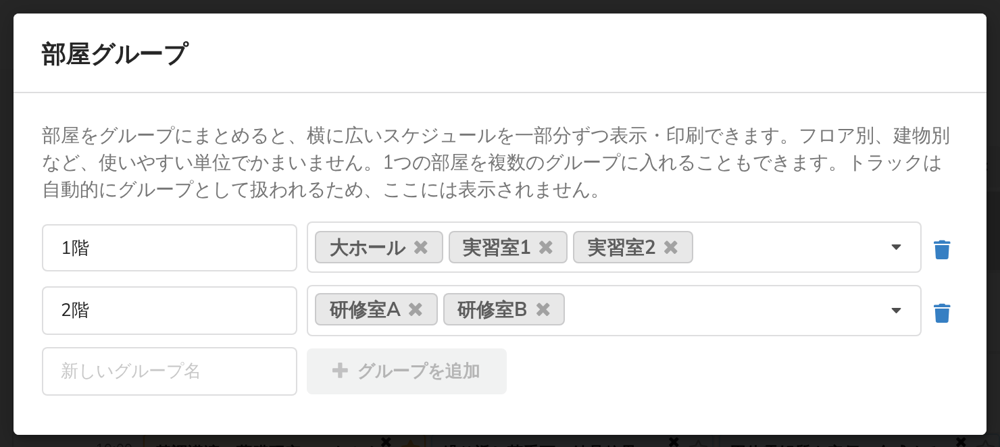
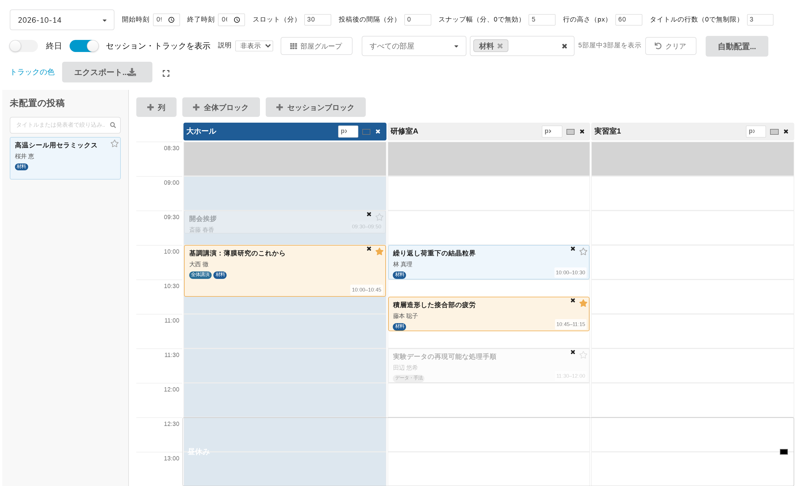

# 9. 部屋グループと絞り込み

30部屋のスケジュールは、紙にも画面にも収まりません。収まる大きさに切り分けるのが絞り込みです。

この章の内容は管理画面でも参加者向けの表示ページでも同じように使え、どちらも絞り込みの状態をアドレスバーに保持します（最後の節を参照）。

## 2つの絞り込み

ツールバーに**すべての部屋**と**すべてのトラック**の2つのプルダウンがあります。片方だけでも、両方同時でも使えます。トラックのプルダウンは、イベントにトラックがある場合にのみ表示されます（**運営者 → プログラム**で作成します）。

部屋のプルダウンには、**名前を付けたグループが先に**（それぞれ含まれる部屋数とともに）、続いて個々の部屋が並びます。組み合わせは自由です。グループを2つと部屋を1つ、といった選び方もごく普通です。

何かを選ぶと、ツールバーに**5部屋中3部屋を表示**のように表示され、絞り込みをすべて解除する**クリア**ボタンが現れます。

## 部屋グループ

グループは、名前を付けた列の集合です。「1階」「本館」「実習棟」など。横に広いスケジュールを一部分ずつ表示・印刷するために使います。

ツールバーの**部屋グループ**をクリックします。

- **新しいグループ名**に名前を入力し、**グループを追加**をクリックします。
- **名前を変えるには**、グループ名の入力欄を編集します。他の場所をクリックするかタブで移動した時点で保存されます。
- 名前の横のプルダウンで、そのグループに入れる部屋を選びます。
- **1つの部屋を複数のグループに入れられます。** グループはスケジュールの見方であって、分割ではありません。いくらでも重なってかまいません。
- ごみ箱アイコンでグループを削除します。含まれていた部屋には影響しません。削除されるのはグループ分けだけで、列そのものではありません。

**トラックごとにグループを作る必要はありません。** トラックには専用の絞り込み（次の節で説明する**すべてのトラック**のプルダウン）があるため、部屋グループの画面には表示されず、実際のトラックと同期させ続けるべき「トラック用のグループ」も存在しません。（画面上の説明文では「トラックは自動的にグループとして扱われるため、ここには表示されません。」と書かれています。）

## トラックの絞り込みは、あえて挙動が違います

**部屋**で絞り込むと、ほかの部屋は非表示になります。これは予想どおりでしょう。

**トラック**で絞り込むと、単に隠すよりも役に立つことをします。

- そのトラックの投稿が入っている**部屋を残し**、それ以外の部屋を外します。
- 残した部屋の中では、ほかのトラックの投稿は**消さずに灰色にします**。

こうすることで、その部屋がいつ埋まっているかは紙の上でも分かります。「材料」のプログラムを渡したとき、同じ部屋のほかの4件がなかったことになっていると、実際には使用中の部屋へ人を送ってしまいます。灰色のブロックが、その日の実態を正しく伝えます。

## 未配置の投稿パネルもトラックの絞り込みに従います

管理画面では、**トラック**の絞り込みが未配置の投稿パネルにも効きます。「エネルギーの投稿をまとめて配置する」という進め方ができるのはこのためです。エネルギーで絞り込めば、パネルにはエネルギーの投稿だけが残ります。

パネル自身の検索欄（**タイトルまたは発表者で絞り込み…**）でさらに絞り込め、両方を組み合わせられます。

## ブックマークと共有

**絞り込みと表示中の日は、ページのアドレスに保持されます。** つまり、特定の画面をブックマークしたり、同僚にメールで送ったり、来年まったく同じ条件で印刷し直したりできます。

再読み込みしても選択は失われません。ただし、絞り込みを変えてもブラウザの履歴には追加されないため、「戻る」は直前の絞り込みを取り消すのではなくページ自体を離れます。取り消したいときは**クリア**を使ってください。

## 全画面表示

ツールバー右端のアイコンでグリッドが画面全体に広がります（**全画面表示**、戻るときは**全画面表示を終了**）。管理画面でも表示ページでも使えます。プロジェクターで映すときや、多くの列に一度に投稿を配置するときに便利です。
