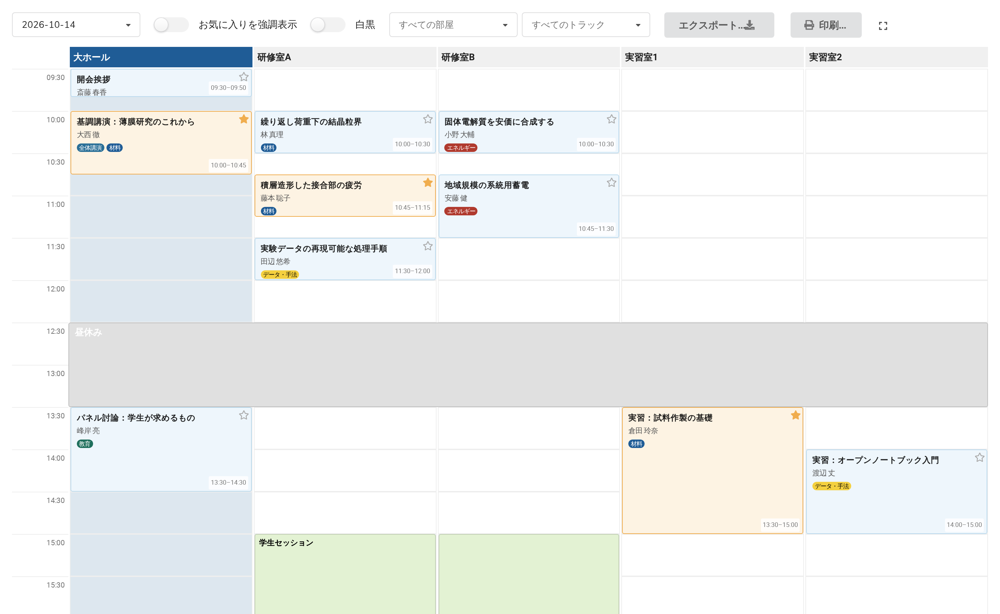
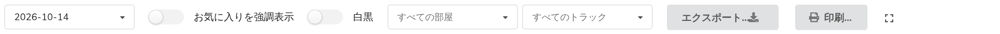
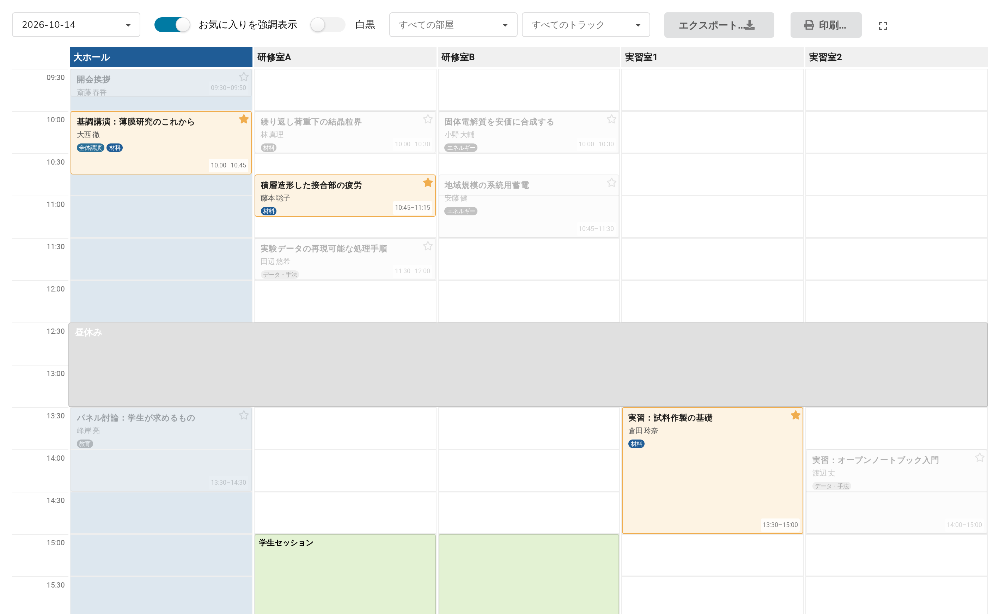

# 11. 参加者に見えるページ

機能をオンにすると、イベントの公開メニューに **Block Schedule** の項目が追加されます。これが表示ページです。編集用のコントロールを除いた、同じグリッドです。

自分で確認するときは、管理画面上部の**閲覧ビューに切替**から、イベントのメニューの **Block Schedule** を開きます。参加者がたどるのとまったく同じ経路です。

## ページの内容

| コントロール | 役割 |
|---|---|
| 日付の選択 | 表示する日 |
| **お気に入りを強調表示** | 下記参照（ログインしている閲覧者のみ） |
| **白黒** | 色をすべて落とします。コピー機向け |
| **すべての部屋**、**すべてのトラック** | 第9章と同じ絞り込み |
| **エクスポート…** | CSV、ODS、Excel（第12章） |
| **印刷…** | 第12章 |
| 隅のアイコン | 全画面表示 |

各ブロックはその投稿の個別ページに直接リンクしているので、グリッドから説明まで1クリックで進めます。

## お気に入りと「お気に入りを強調表示」

**ログインしている閲覧者**には、各ブロックに**星**が表示され、その投稿をお気に入りに追加できます。Indico の他の場所で使われているものと同じ「お気に入りに追加」です。投稿の個別ページを開かなくても、グリッドから直接操作できます。

お気に入りに追加した投稿は、表示される場所すべてで琥珀色の枠線とともに描かれます。

ログインしていない閲覧者には、**星も「お気に入りを強調表示」のトグルも表示されません**。どちらも、お気に入りを紐づけるアカウントがある場合にのみ描かれます。参加者に「星を押してください」と案内する前に、先にログインが必要である点を思い出してください。

**お気に入りを強調表示**をオンにすると、お気に入りに入れていない投稿が薄くなります。

薄くなった投稿も**位置はそのまま**である点に注目してください。その日の流れは引き続き読み取れる（何を逃しているか、その部屋がいつ埋まっているかが分かる）うえで、選んだ投稿が浮かび上がります。トグルをオフにすれば元に戻ります。

これは閲覧者ごとの表示です。イベントの内容も、他の閲覧者に見えるものも変わりません。

## 白黒

列の色、トラックのバッジ、セッションのバッジまで、グリッド全体をグレースケールに変換します。

これはモノクロのプリンターが行うのと同じ変換なので、実質的にはプレビューです。印刷前にクリックすれば、どの色とどの色が同じ灰色になるかがその場で分かります。直すにはトグルではなく色そのものを変えてください（第8章）。

## 長い日と横に広いグリッド

見落としやすい点が2つあります。

**横に広いグリッドでは、横スクロールバーがウィンドウ下端に固定されます。** グリッド自身のスクロールバーは何画面分もある表の一番下にあり、つまり必要なときにかぎって画面の外にあるからです。

なお、このページでは列の見出しはグリッドと一緒にスクロールして消えます。見出しの固定は管理グリッドだけの機能なので、1日が非常に長い場合は部屋の並び順を覚えておくか、部屋を絞り込んで表示してください。

## 誰に何が見えるか

表示ページには、**その閲覧者が見てよい投稿だけ**が表示されます。公開イベントの中で保護されている投稿は、アクセス権のない人にはグリッドにも、表計算のエクスポートにも、スマートフォンアプリの保存データにも現れません。管理者が同じページを見れば、すべて表示されます。

そのための設定は不要で、イベント自身の保護設定に従います。
