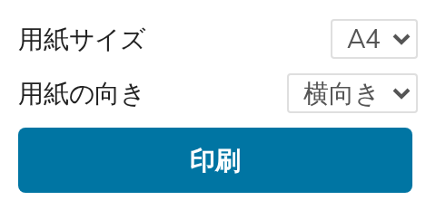
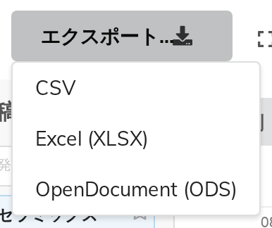

# 12. 印刷とエクスポート

どちらも**表示ページ**から使えます。エクスポートは管理画面にもあります。

## 印刷

表示ページの**印刷…**をクリックします。

| 項目 | 選択肢 |
|---|---|
| **用紙サイズ** | A4、A3、A2 |
| **用紙の向き** | 横向き、縦向き |
| **印刷** | ブラウザの印刷ダイアログを開きます |

### 印刷される範囲

**グリッドだけ**です。Indico のヘッダーも、イベントのサイドメニューも、パンくずリストも印刷されません。グリッドの上には見出しが追加され、次の内容が入ります。

- **イベントのタイトル**
- 表示している**日**
- 適用中の**絞り込み**（あれば）

最後の1行があることで、印刷した紙の束が使えるものになります。同じ日を階ごとに4枚印刷しても、どの紙がどの階のものか分かります。

### 1日を1ページに収めるには

効果の大きい順に、

1. **絞り込む。** 1枚につき1つの階、あるいは1つのトラック。部屋グループ（第9章）はこのためにあります。
2. **大きくする、または横向きにする。** A3 は A4 のおよそ2倍、A2 はおよそ4倍です。用紙を横向きにしても面積は変わりませんが、グリッドが広がれる方向が変わります。
3. **行の高さ（px）を小さくする。** 半分にすれば1日の高さも半分になります。
4. **タイトルの行数を減らす**、または**セッション・トラックを表示**をオフにして、各ブロックが抱える内容を減らす。

### モノクロで印刷する

先に**白黒**をオンにしてください。印刷にもそれが反映されます。

このトグルが行うのは、画面上でグリッドをグレースケールに変換することです。モノクロのプリンターが行う変換と同じなので、これから印刷されるものの**プレビュー**になります。そこに価値があります。明るさの近い2つのトラックの色は同じ灰色になってしまいますが、40枚印刷したあとではなく、この時点でそれに気づいて色を変えられます（第8章）。

## エクスポート

**エクスポート…**をクリックします。

形式は **CSV**、**Excel (XLSX)**、**OpenDocument (ODS)** の3つです。いずれも**いま表示している日の全体**を出力します。

> **エクスポートには絞り込みが適用されません。** 絞り込んだ状態がそのまま印刷される印刷とは違い、エクスポートは画面の設定にかかわらず、その日のすべての部屋・すべてのトラックを含みます。絞り込みは、開いた表計算ソフト側で行ってください。

### ファイルの中身

**CSV** は1つの表です。配置済みの投稿1件につき1行で、列順・時刻順に並び、次の項目が入ります。

| Column | Start | End | Duration (min) | Title | Speakers | Session | Track |
|---|---|---|---|---|---|---|---|

**Excel と OpenDocument** は、同じ表を *Contributions* という名前の1枚目のシートに収め、さらに **Schedule Grid** という2枚目のシートを追加します。こちらは実際のグリッドと同じ形に配置されています。表計算の1列が1部屋、縦方向が時間で、**1件の発表につき1つの結合セル**が実際の所要時間ぶんの高さを占め、その中に部屋・セッション・トラック・発表者・日時が入ります。

印刷プログラムの版下を作る担当者に渡すなら、この2枚目のシートです。どの表計算ソフトでも開けて、すでに紙面の形になっています。

### 表示ページからのエクスポート

同じメニューが表示ページにもあり、そこでは**その閲覧者が見てよいもの**だけが出力されます。公開イベントの中で保護されている投稿はファイルに含まれません。管理画面からのエクスポートにはこの制限はありません。管理者はいずれにせよすべてを見られるためです。
