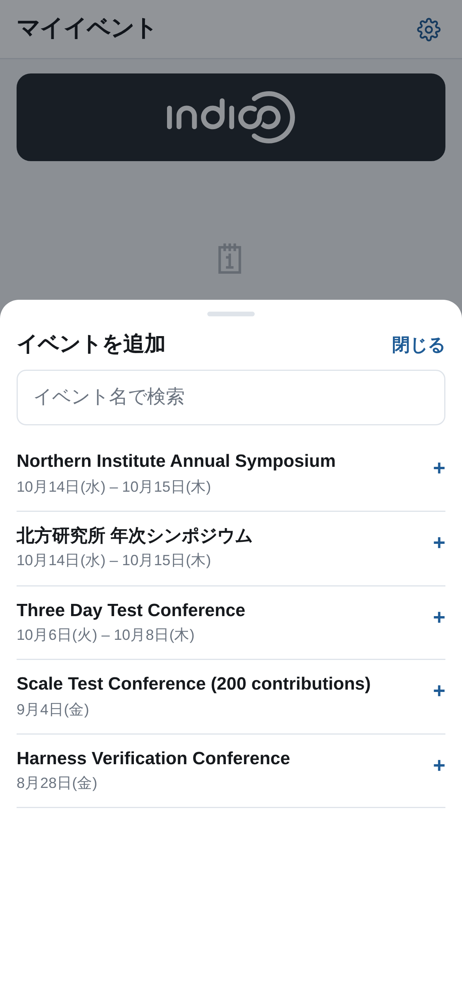
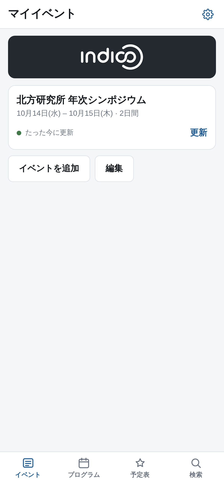
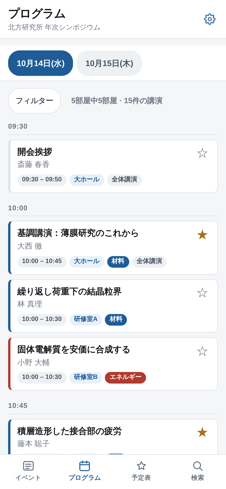
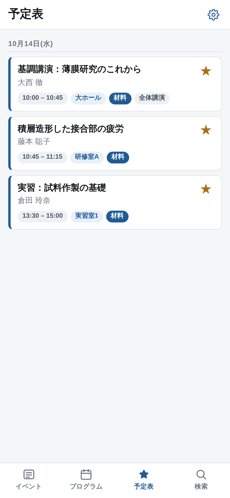
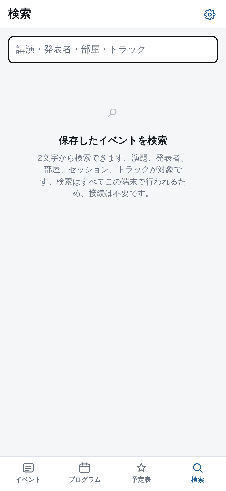

# 13. スマートフォンアプリ

Block Schedule を導入しているサイトでは、同じスケジュールを読むための**スマートフォンアプリ**を参加者に提供できる場合があります。これは別のソフトウェアで、導入するのは Indico サイトの運用担当者ですが、そこに表示されるのは*あなたが*作ったものです。何がアプリに届くのかは知っておく価値があります。

利用できるかどうか、またそのアドレスは、サイト管理者に確認してください。通常は同じサイトの **/schedule-app/** です。

## 参加者が行うこと

アドレスを開き、**イベントを追加**をタップして、自分のカンファレンスを探します。Indico のカテゴリーツリーを上からたどるか、検索欄に名前を入力します。

一覧に出るのは、**実際にブロックスケジュールがあるイベント**だけです。イベント数の多いカテゴリーでは一定件数ずつ確認され、続きを確認するボタンが表示されます。選ぶとプログラム全体が端末にコピーされ、以後は通信がなくても使えます。

## 参加者に見えるもの

30の部屋はスマートフォンの画面に収まらないため、グリッドはその日の時刻順の一覧になります。講演も時刻も部屋も同じものです。

あなたの作業が引き継がれている点に注目してください。入力した**部屋の名前**、第8章の**トラック名とその色**、そしてセッション名です。

**フィルター**のシートでは、部屋グループ・個々の部屋・トラックでその日を絞り込めます。プラグイン自身の絞り込み（第9章）と同じルール、同じ URL パラメーターを使うため、絞り込んだリンクはブラウザでもアプリでも同じように働きます。設定した部屋グループが役に立つのはここです。

講演をタップすると個別の画面が開き、**アブストラクトの全文**と発表者の所属が端末に保存された状態で表示されます。これらは Indico の投稿エクスポートから取得されるため、イベントの投稿が**公開**されている必要があります。公開されるまでは「この講演のアブストラクトは公開されていません。」と表示されます。

**お気に入りに追加するには、参加者が Indico にログインしている必要があります。** ログインしていない状態で星をタップすると、保存されるのではなくログインを促すシートが表示され、予定表のタブも一覧ではなく未ログインの表示になります。ログアウトすると端末上の予定表のコピーは削除されますが、アカウント側には残ります。

お気に入りに入れた講演は、追加したすべてのイベントを横断して**予定表**に集まります。重なっている講演は1つの枠にまとめられ、「2件を同時に入れてしまった」という事実が、離れた2行としてではなく1つの事実として見えるようになっています。

検索は通信ではなく端末に保存されたデータに対して行われるため、電波がなくても使えます。タイトル・発表者・部屋・セッション・トラックが対象なので、「小野さんはどの部屋？」といった問いにも答えられます。

## 運営者が決められること

アプリに表示される内容はすべて Indico から来るので、普段の作業がそのままアプリに届きます。

| 運営者の作業 | アプリでの現れ方 |
|---|---|
| 列に名前を付ける | すべての講演の部屋 |
| **トラックの色**を設定する（第8章） | 各講演の色帯とバッジ |
| **カスタマイズ → レイアウト**でイベントのロゴを設定する | 一覧に並ぶイベントのカード |
| 投稿を公開する | 講演の画面でアブストラクトが読めるようになる |
| 投稿を保護する | 端末にコピーされません |
| 配置を変更する | 参加者が次に更新したとき |

お気に入りは Indico 本体と共有されます。アプリで付けた星はイベントのページにも現れ、ウェブサイトで付けた星はアプリにも現れます。

## 参加者に伝えておくとよいこと

- **プログラムの変更を反映するには更新が必要です。** 各イベントのカードにはコピーの新しさが表示され、**更新**ボタンがあります。開催前日にプログラムを変えたときは、そのことを伝えてください。
- **英語と日本語に対応しています。** 画面の言語は端末の設定に従い、アプリの設定で切り替えることもできます。講演のタイトル、発表者名、部屋名、トラック名は、あなたが入力したとおりの言語・表記で表示されます。
- **ホーム画面への追加と完全なオフライン利用には HTTPS が必要です。** `http://` で提供されているサイトでは、ブラウザ上では動作しますがホーム画面に追加できず、その旨が表示されます。

## これは何ではないか

参加登録の仕組みでも、通知の仕組みでも、何かを公開する場所でもありません。すでに公開したスケジュールを読み取り専用でコピーしたものであり、電波の届かない会議場の地下でも使える形にしたものです。
